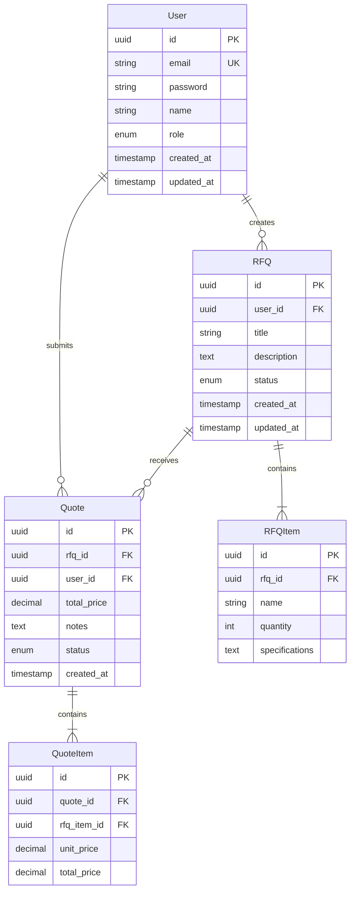

# 데이터베이스

OSM RFQ Backend 데이터베이스 스키마 및 모델 문서입니다.

## 🗄️ 데이터베이스 종류

향후 결정될 예정입니다. 예상:

- **Primary DB**: PostgreSQL 14+
- **Cache**: Redis (선택사항)
- **File Storage**: AWS S3 / MinIO (선택사항)

## 📊 ERD (Entity Relationship Diagram)



## 📋 테이블 스키마

### Users (사용자)

| 컬럼 | 타입 | 제약조건 | 설명 |
|------|------|----------|------|
| id | UUID | PK | 사용자 ID |
| email | VARCHAR(255) | UNIQUE, NOT NULL | 이메일 |
| password | VARCHAR(255) | NOT NULL | 해시된 비밀번호 |
| name | VARCHAR(100) | NOT NULL | 이름 |
| role | ENUM | NOT NULL | 역할 (admin, user) |
| created_at | TIMESTAMP | DEFAULT NOW() | 생성일시 |
| updated_at | TIMESTAMP | DEFAULT NOW() | 수정일시 |

### RFQs (견적 요청)

| 컬럼 | 타입 | 제약조건 | 설명 |
|------|------|----------|------|
| id | UUID | PK | 견적 요청 ID |
| user_id | UUID | FK → users.id | 작성자 ID |
| title | VARCHAR(200) | NOT NULL | 제목 |
| description | TEXT | | 상세 설명 |
| status | ENUM | NOT NULL | 상태 (pending, approved, rejected) |
| created_at | TIMESTAMP | DEFAULT NOW() | 생성일시 |
| updated_at | TIMESTAMP | DEFAULT NOW() | 수정일시 |

### RFQItems (견적 요청 항목)

| 컬럼 | 타입 | 제약조건 | 설명 |
|------|------|----------|------|
| id | UUID | PK | 항목 ID |
| rfq_id | UUID | FK → rfqs.id | 견적 요청 ID |
| name | VARCHAR(200) | NOT NULL | 상품명 |
| quantity | INTEGER | NOT NULL | 수량 |
| specifications | TEXT | | 상세 사양 |

### Quotes (견적서)

| 컬럼 | 타입 | 제약조건 | 설명 |
|------|------|----------|------|
| id | UUID | PK | 견적서 ID |
| rfq_id | UUID | FK → rfqs.id | 견적 요청 ID |
| user_id | UUID | FK → users.id | 제출자 ID |
| total_price | DECIMAL(12,2) | NOT NULL | 총 금액 |
| notes | TEXT | | 비고 |
| status | ENUM | NOT NULL | 상태 (draft, submitted, accepted) |
| created_at | TIMESTAMP | DEFAULT NOW() | 생성일시 |

### QuoteItems (견적서 항목)

| 컬럼 | 타입 | 제약조건 | 설명 |
|------|------|----------|------|
| id | UUID | PK | 항목 ID |
| quote_id | UUID | FK → quotes.id | 견적서 ID |
| rfq_item_id | UUID | FK → rfq_items.id | 견적 요청 항목 ID |
| unit_price | DECIMAL(10,2) | NOT NULL | 단가 |
| total_price | DECIMAL(12,2) | NOT NULL | 합계 금액 |

## 🔑 인덱스

성능 최적화를 위한 인덱스:

```sql
-- Users
CREATE INDEX idx_users_email ON users(email);

-- RFQs
CREATE INDEX idx_rfqs_user_id ON rfqs(user_id);
CREATE INDEX idx_rfqs_status ON rfqs(status);
CREATE INDEX idx_rfqs_created_at ON rfqs(created_at DESC);

-- Quotes
CREATE INDEX idx_quotes_rfq_id ON quotes(rfq_id);
CREATE INDEX idx_quotes_user_id ON quotes(user_id);
CREATE INDEX idx_quotes_status ON quotes(status);
```

## 🔄 마이그레이션

### Prisma 예시

```typescript
// prisma/schema.prisma
model User {
  id        String   @id @default(uuid())
  email     String   @unique
  password  String
  name      String
  role      Role     @default(USER)
  createdAt DateTime @default(now())
  updatedAt DateTime @updatedAt

  rfqs      RFQ[]
  quotes    Quote[]

  @@index([email])
}

enum Role {
  ADMIN
  USER
}
```

### 마이그레이션 실행

```bash
# Prisma
npx prisma migrate dev --name init

# SQLAlchemy
alembic revision --autogenerate -m "Initial migration"
alembic upgrade head

# GORM
go run cmd/migrate/main.go
```

## 🌱 시드 데이터

개발 환경을 위한 시드 데이터:

```bash
# Prisma
npx prisma db seed

# Custom script
npm run seed
```

## 🛡️ 보안

- 모든 비밀번호는 bcrypt로 해시
- UUID를 사용한 Primary Key
- SQL Injection 방지 (ORM 사용)
- 민감한 데이터 암호화

## 📊 백업 전략

- 자동 백업: 매일 03:00 (KST)
- 보관 기간: 30일
- 백업 저장소: AWS S3 / MinIO

## 🔗 관련 문서

- [API 문서](../api/index.md)
- [Backend 시작하기](../getting-started.md)
