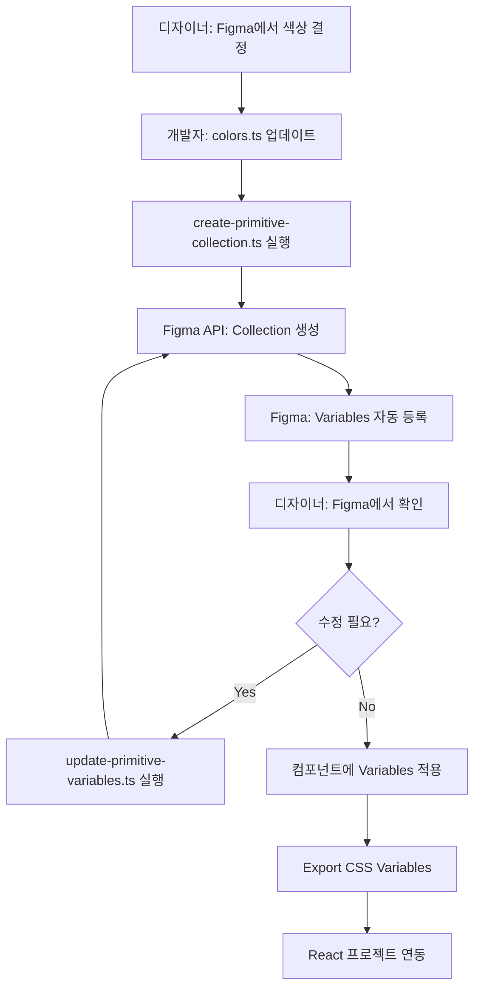

# Figma REST API 자동화 가이드

> **Figma REST API를 사용하여 Primitive Collection Variables를 자동으로 생성/업데이트하는 방법**

---

## 📚 개요

이 가이드는 Figma REST API를 활용하여 Blue와 Neutral 색상 팔레트를 자동으로 Figma Variables로 등록하는 방법을 설명합니다.

**장점**:
- ✅ 수동 작업 없이 22개 색상 자동 등록
- ✅ 버전 관리 가능 (코드로 관리)
- ✅ CI/CD 파이프라인 통합 가능
- ✅ 대규모 디자인 시스템 관리 용이

---

## 🎯 준비 사항

### 1. Figma Access Token 발급

**단계**:
1. [Figma](https://www.figma.com) 로그인
2. 우측 상단 프로필 → **Settings** 클릭
3. **Account** 탭 선택
4. **Personal access tokens** 섹션으로 스크롤
5. **Generate new token** 클릭
6. Token 이름 입력 (예: "Design System Automation")
7. **Generate token** 클릭
8. 생성된 토큰 복사 (⚠️ 다시 볼 수 없으니 안전한 곳에 보관)

**권한 요구사항**:
- ✅ `file_variables:write` scope 필요
- ✅ Enterprise 플랜 (Variables REST API는 Enterprise 전용)

### 2. Figma File Key 확인

**Figma 파일 URL 구조**:
```
https://www.figma.com/file/ABC123xyz789/Your-Design-File-Name
                              ↑
                        이 부분이 FILE_KEY
```

**예시**:
- URL: `https://www.figma.com/file/XyZ123AbC/Design-System`
- FILE_KEY: `XyZ123AbC`

### 3. 환경 변수 설정

**.env 파일 생성**:
```bash
cp .env.example .env
```

**.env 파일 편집**:
```env
FIGMA_ACCESS_TOKEN=figd_abc123xyz789_your_actual_token_here
FIGMA_FILE_KEY=XyZ123AbC
```

⚠️ **주의**: `.env` 파일은 절대 Git에 커밋하지 마세요!

---

## 🚀 스크립트 사용 방법

### 1️⃣ Primitive Collection 생성

**스크립트**: [scripts/figma/create-primitive-collection.ts](../scripts/figma/create-primitive-collection.ts)

**기능**:
- Primitive Collection 생성
- Default Mode 생성
- Blue 색상 10개 Variable 생성
- Neutral 색상 12개 Variable 생성
- 각 Variable에 Hex 색상 값 설정

**실행 명령어**:
```bash
npm run figma:create-primitive
```

또는:
```bash
FIGMA_ACCESS_TOKEN=your_token \
FIGMA_FILE_KEY=your_file_key \
npx ts-node scripts/figma/create-primitive-collection.ts
```

**실행 결과**:
```
🎨 Figma Primitive Collection 생성 시작

📁 Figma File Key: XyZ123AbC
🔑 Access Token: figd_abc12...

📋 기존 Variables 확인 중...

✅ Variables 조회 완료!

🏗️  Primitive Collection 생성 중...

📊 생성할 항목:
  - Collections: 1개
  - Modes: 1개
  - Variables: 22개
    • Blue: 10개
    • Neutral: 12개
  - Mode Values: 22개

📡 Figma API 요청 시작...
URL: https://api.figma.com/v1/files/XyZ123AbC/variables
데이터 크기: 8543 bytes
✅ API 요청 성공!

✨ Primitive Collection 생성 완료!

🎯 생성된 ID 매핑:
{
  "temp-collection-primitive": "VariableCollectionId:123:456",
  "temp-mode-default": "789:0",
  "temp-var-blue-50": "VariableID:123:789/50:100",
  ...
}

🔗 Figma에서 확인:
https://www.figma.com/file/XyZ123AbC

💡 다음 단계:
  1. Figma를 열고 Variables 패널 확인
  2. "Primitive" Collection에서 모든 색상 확인
  3. 컴포넌트에 Variables 적용 시작

✅ 스크립트 실행 완료
```

### 2️⃣ Variables 업데이트

**스크립트**: [scripts/figma/update-primitive-variables.ts](../scripts/figma/update-primitive-variables.ts)

**기능**:
- 기존 Primitive Collection의 Variable 값 업데이트
- 선택적으로 특정 색상만 업데이트

**업데이트할 색상 지정**:
```typescript
// update-primitive-variables.ts 파일 수정
const VARIABLES_TO_UPDATE: UpdateVariableValue[] = [
  {
    variableName: 'blue-500',
    newHexColor: '#0050FF', // 새로운 색상
    description: 'Updated primary blue',
  },
  {
    variableName: 'Neutral700',
    newHexColor: '#5F6467',
    description: 'Updated neutral 700',
  },
];
```

**실행 명령어**:
```bash
npm run figma:update-primitive
```

---

## 📦 package.json 스크립트 추가

[package.json](../package.json)에 다음 스크립트 추가:

```json
{
  "scripts": {
    "figma:create-primitive": "ts-node scripts/figma/create-primitive-collection.ts",
    "figma:update-primitive": "ts-node scripts/figma/update-primitive-variables.ts"
  },
  "devDependencies": {
    "ts-node": "^10.9.2"
  }
}
```

**ts-node 설치**:
```bash
npm install --save-dev ts-node
```

---

## 🔍 스크립트 상세 분석

### API 요청 구조

#### POST /v1/files/:file_key/variables

**Endpoint**:
```
POST https://api.figma.com/v1/files/{file_key}/variables
```

**Headers**:
```http
X-Figma-Token: {your_access_token}
Content-Type: application/json
```

**Request Body**:
```json
{
  "variableCollections": [
    {
      "action": "CREATE",
      "id": "temp-collection-primitive",
      "name": "Primitive",
      "initialModeId": "temp-mode-default"
    }
  ],
  "variableModes": [
    {
      "action": "CREATE",
      "id": "temp-mode-default",
      "name": "Default",
      "variableCollectionId": "temp-collection-primitive"
    }
  ],
  "variables": [
    {
      "action": "CREATE",
      "id": "temp-var-blue-500",
      "name": "blue-500",
      "variableCollectionId": "temp-collection-primitive",
      "resolvedType": "COLOR",
      "scopes": ["ALL_FILLS", "ALL_STROKES", "TEXT_FILL"],
      "description": "Primary blue color"
    }
  ],
  "variableModeValues": [
    {
      "variableId": "temp-var-blue-500",
      "modeId": "temp-mode-default",
      "value": {
        "r": 0,
        "g": 0.3098,
        "b": 1,
        "a": 1
      }
    }
  ]
}
```

**Response**:
```json
{
  "status": 200,
  "error": false,
  "tempIdToRealId": {
    "temp-collection-primitive": "VariableCollectionId:123:456",
    "temp-mode-default": "789:0",
    "temp-var-blue-500": "VariableID:123:789/50:100"
  }
}
```

### Hex to RGBA 변환

**함수**:
```typescript
function hexToRgba(hex: string): { r: number; g: number; b: number; a: number } {
  const result = /^#?([a-f\d]{2})([a-f\d]{2})([a-f\d]{2})$/i.exec(hex);
  return {
    r: parseInt(result[1], 16) / 255,
    g: parseInt(result[2], 16) / 255,
    b: parseInt(result[3], 16) / 255,
    a: 1,
  };
}
```

**예시**:
- `#004FFF` → `{ r: 0, g: 0.3098, b: 1, a: 1 }`
- `#FFFFFF` → `{ r: 1, g: 1, b: 1, a: 1 }`

---

## ⚠️ 주의사항 및 제한사항

### 1. Enterprise 플랜 필요
- Variables REST API는 **Enterprise 플랜에서만 사용 가능**
- Pro/Team 플랜에서는 작동하지 않음

### 2. 권한 요구사항
- ✅ Edit 권한 필요 (View-only는 불가)
- ✅ `file_variables:write` scope 필요
- ✅ Full seat 또는 Admin 계정 필요

### 3. API 제한
- 최대 요청 크기: **4MB**
- Collection당 최대 Mode: **40개**
- Collection당 최대 Variable: **5,000개**
- Mode 이름 최대 길이: **40자**

### 4. Alias 제한
- Variable은 자기 자신을 참조할 수 없음
- 순환 참조 불가 (A → B → C → A)

### 5. 중복 생성 방지
- 스크립트는 기존 Collection 확인
- 중복 생성 시 경고 메시지 출력

---

## 🧪 테스트 방법

### 1. Dry Run (실제 생성 없이 테스트)

**스크립트 수정**:
```typescript
// create-primitive-collection.ts
async function main() {
  // ...
  const requestData = buildPrimitiveCollectionRequest();

  // API 호출 대신 콘솔 출력만
  console.log('📋 생성할 데이터:');
  console.log(JSON.stringify(requestData, null, 2));

  // const response = await client.postVariables(requestData); // 주석 처리
}
```

### 2. Sandbox 파일에서 테스트
1. Figma에서 테스트용 파일 생성
2. 테스트 파일의 FILE_KEY 사용
3. 성공 확인 후 실제 파일에 적용

---

## 🔧 트러블슈팅

### 문제 1: 401 Unauthorized
**원인**: Access Token이 잘못되었거나 만료됨
**해결**:
```bash
# 토큰 재발급
# Figma → Settings → Account → Personal access tokens → Generate new token
```

### 문제 2: 403 Forbidden
**원인**:
- Enterprise 플랜이 아님
- 파일에 대한 Edit 권한 없음
- Token scope 부족

**해결**:
- Enterprise 플랜 구독 확인
- 파일 소유자에게 Edit 권한 요청
- `file_variables:write` scope로 토큰 재발급

### 문제 3: 404 Not Found
**원인**: FILE_KEY가 잘못됨

**해결**:
```bash
# Figma 파일 URL에서 FILE_KEY 다시 확인
# https://www.figma.com/file/XyZ123AbC/...
#                              ↑ 이 부분
```

### 문제 4: Collection이 중복 생성됨
**원인**: 스크립트를 여러 번 실행함

**해결**:
1. Figma에서 중복 Collection 삭제
2. 또는 `update-primitive-variables.ts` 사용하여 업데이트만 수행

---

## 🔄 CI/CD 통합

### GitHub Actions 예시

**.github/workflows/sync-figma-variables.yml**:
```yaml
name: Sync Figma Variables

on:
  push:
    branches:
      - main
    paths:
      - 'scripts/figma/**'

jobs:
  sync:
    runs-on: ubuntu-latest

    steps:
      - uses: actions/checkout@v4

      - name: Setup Node.js
        uses: actions/setup-node@v4
        with:
          node-version: '20'

      - name: Install dependencies
        run: npm ci

      - name: Sync Figma Variables
        env:
          FIGMA_ACCESS_TOKEN: ${{ secrets.FIGMA_ACCESS_TOKEN }}
          FIGMA_FILE_KEY: ${{ secrets.FIGMA_FILE_KEY }}
        run: npm run figma:update-primitive

      - name: Notify Slack
        if: success()
        run: |
          curl -X POST -H 'Content-type: application/json' \
          --data '{"text":"✅ Figma Variables 동기화 완료!"}' \
          ${{ secrets.SLACK_WEBHOOK_URL }}
```

**GitHub Secrets 설정**:
1. Repository → Settings → Secrets and variables → Actions
2. `FIGMA_ACCESS_TOKEN` 추가
3. `FIGMA_FILE_KEY` 추가

---

## 📊 전체 워크플로우



---

## 📝 다음 단계

이제 Figma에 Variables가 생성되었으니:

1. ✅ [Figma Collection Primitive 가이드](./figma-collection-primitive-guide.md) 참고
2. ✅ Figma에서 Variables를 컴포넌트에 적용
3. ✅ CSS Variables로 Export
4. ✅ React 프로젝트에 통합

---

## 🔗 참고 자료

- [Figma Variables REST API 공식 문서](https://developers.figma.com/docs/rest-api/variables/)
- [Figma Plugin API - Variables](https://www.figma.com/plugin-docs/working-with-variables/)
- [Figma Community: Variables REST API 예제](https://www.figma.com/community/file/1270821372236564565)
- [Design Tokens 동기화 가이드](https://medium.com/@NateBaldwin/synchronizing-figma-variables-with-design-tokens-3a6c6adbf7da)

---

## ✅ 체크리스트

### 초기 설정
- [ ] Figma Access Token 발급
- [ ] FILE_KEY 확인
- [ ] `.env` 파일 생성 및 설정
- [ ] `ts-node` 설치

### Collection 생성
- [ ] `create-primitive-collection.ts` 실행
- [ ] Figma에서 Collection 확인
- [ ] 모든 색상 Variables 확인 (22개)

### Variables 적용
- [ ] 컴포넌트에 Variables 적용
- [ ] CSS Variables로 Export
- [ ] React 프로젝트 연동

### 자동화 (선택)
- [ ] GitHub Actions 설정
- [ ] CI/CD 파이프라인 구축
- [ ] Slack 알림 연동

---

**작성일**: 2025-01-04
**작성자**: Claude Code
**버전**: 1.0.0
